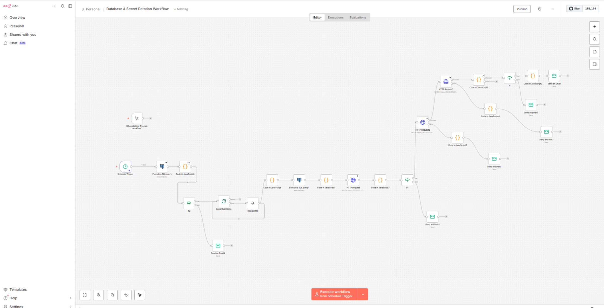

# n8n-credential-rotation
<<<<<<< HEAD
n8n Database Credential Rotation - Automated PostgreSQL password rotation with Kubernetes secret sync. Runs monthly, generates secure passwords, updates secrets, restarts deployments with zero downtime, and sends detailed failure emails. Production-ready workflow with comprehensive error handling.
=======

Automated, zero-touch PostgreSQL credential rotation with n8n and Kubernetes. This project provides a production-ready workflow to rotate database credentials, update Kubernetes secrets, and restart deployments with zero downtime.

## Features
- Monthly scheduled password rotation for PostgreSQL users
- Automatic update of Kubernetes secrets
- Rolling restart of deployments for zero downtime
- Error handling with detailed email notifications
- Security best practices and auditability

## Quick Start
See `docs/setup-guide.md` for full setup instructions.

## Repository Structure
- `docs/` — Guides and architecture
- `workflow/` — n8n workflow export
- `k8s/` — Kubernetes manifests
- `scripts/` — Setup and test scripts
- `templates/` — Email templates

## License
MIT

## n8n Workflow Screenshot

Below is a screenshot of the n8n credential rotation workflow:

>>>>>>> 7d6bb19 (Initial production-ready repository: n8n PostgreSQL credential rotation with Kubernetes and n8n workflow)
